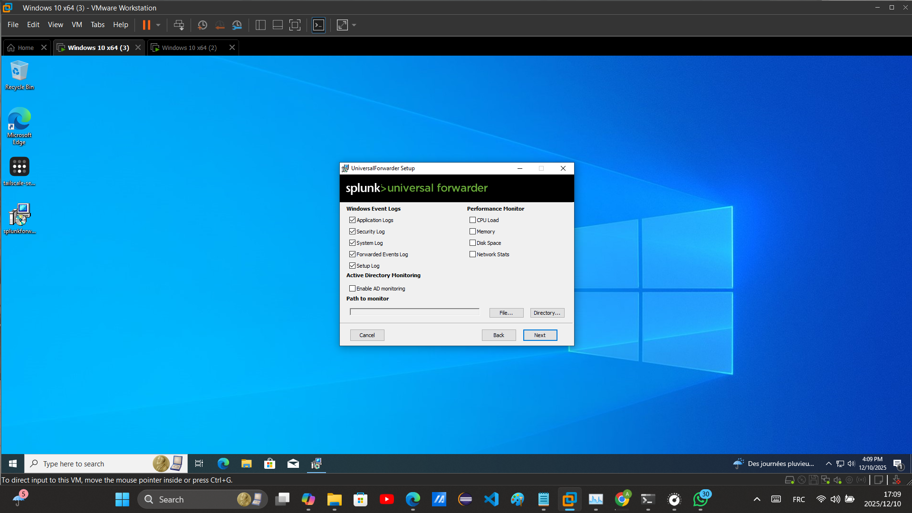

# INTRO

Hello, this time I'm going to set up an environment to practice using a SIEM tool (**Splunk**), which is important in the daily work of a SOC analyst. We’ll go step by step, and everything will become clear.

---

# SETTING UP THE ENVIRONMENT

In this lab, I am using my machine (**Windows 11**) + VMware to create two virtual machines (**Windows 10**) connected via **Tailscale VPN**, along with **Splunk Enterprise** and **Splunk Universal Forwarder**.

The lab architecture is as follows:

```
                      +---------------------------------------+
                      |  MY MACHINE (Admin PC)                |
                      |      Splunk Enterprise Server         |
                      |    (Indexer + Search Head Role)       |
                      +-----------------------+---------------+
                                              |
                                      (Tailscale VPN)
                                              |
             ------------------------------------------------------------------
    (Tailscale VPN)                                                      (Tailscale VPN)
             |                                                                |
             |                                                                |
     Splunk Universal Forwarder                                    Splunk Universal Forwarder
             |                                                                |
             |                                                                |      
    +---------------------+                               +-----------------------------+
    | Windows Endpoint 1  |                               | Windows Endpoint 2          |
    |   - Event Logs      |                               |   - Event Logs              |
    +----------+----------+                               +--------------+--------------+
```

---

## ⇒ Installing Splunk Server


After downloading, install Splunk and test it by opening **localhost:8000** in a browser.


---

## ⇒ Installing Tailscale for the Server and Endpoints

Install Tailscale on the server and endpoints.

**On the server:**


Generate two auth keys to connect the endpoints:


**On Endpoint 1:**


Repeat the same process for Endpoint 2.

---

## ⇒ Installing Splunk Universal Forwarder

Install the Universal Forwarder on both endpoints and configure it to connect to the Deployment Server and Indexer.


After installation, enable listening on the server for ports **8089** and **9997**:

```cmd
netsh advfirewall firewall add rule name="for Indexer" dir=in action=allow protocol=TCP localport=9997
netsh advfirewall firewall add rule name="for deployment server" dir=in action=allow protocol=TCP localport=8089
```

On the endpoints, enable forwarding:

```cmd
netsh advfirewall firewall add rule name="to the indexer" dir=out action=allow protocol=TCP remoteport=9997
netsh advfirewall firewall add rule name="to the DS" dir=out action=allow protocol=TCP remoteport=8089
```

---

## Why We Used TCP and Ports 9997 and 8089

**Port 9997:** Used by the Splunk Indexer to receive data from Universal Forwarders. TCP ensures reliable delivery of log data, so no events are lost.

**Port 8089:** Used by the Deployment Server to communicate with Universal Forwarders for configuration updates and app deployment. TCP guarantees all configuration messages are reliably sent and received.

---

## ⇒ Log Collection Scope

**Windows logs ingested:**
The Universal Forwarder (UF) is configured to collect all default Windows event logs, including:

* Security log
* System log
* Application logs
* Setup log

> Note: Since the focus is initially on logon events, some of the other logs will not be visible until later.


---

## ⇒ Current Detection Focus

Even though multiple logs are being indexed, the detection will initially focus specifically on the **Security log (`WinEventLog:Security`)**, including Event IDs:

* **4624** – Successful logon
* **4625** – Failed logon
* **4672** – Special privileges assigned to a new logon

Other log sources, such as **PowerShell execution logs, process creation monitoring, service installation events, firewall activity, and file share access events**, will be incorporated in future detections after completing the analysis of security logs.

---

## ⇒ Forwarder Configuration

* The Universal Forwarder is installed on both Endpoint 1 and Endpoint 2.
* Logs are forwarded to the Splunk server via **TCP port 9997**.
* After finishing the important security logs, additional logs will be collected for deeper analysis.

---

Everything should now be working perfectly. After logging in to the Splunk Search Head, we can confirm that both Universal Forwarders are successfully connected to the Splunk server:


This confirms that the lab environment is properly set up, and the endpoints are ready to forward logs to the Splunk Indexer.

---

That's all for this report.

---


