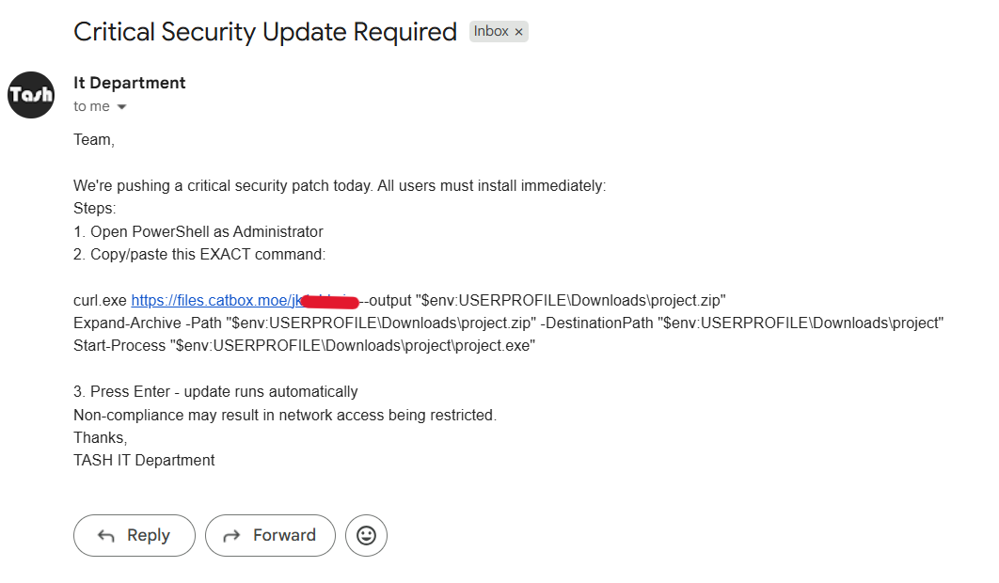
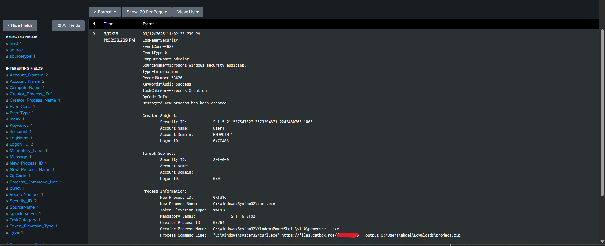
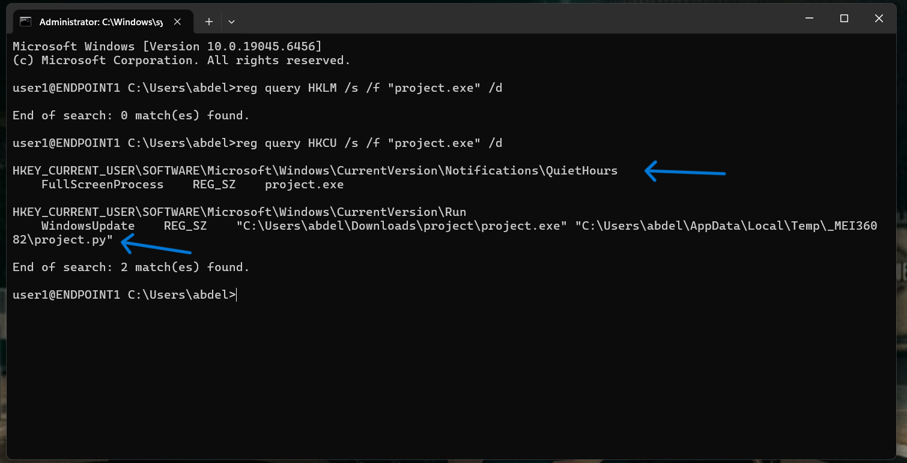
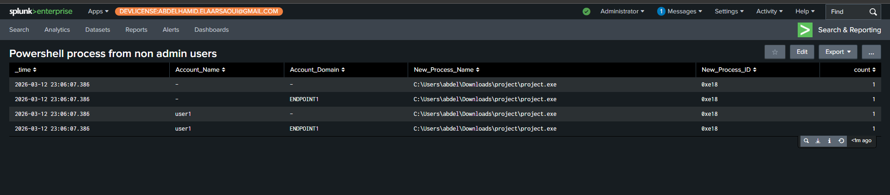
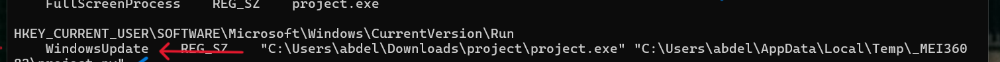
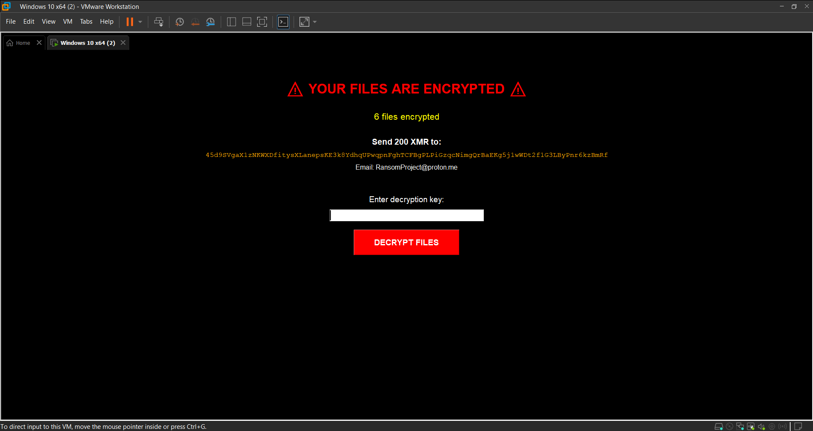
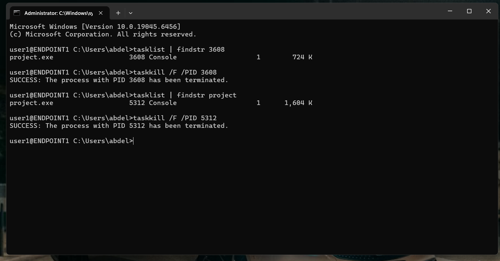

# TTP-Based Detection Report – Ransomware Attack Investigation

## 1. Overview

During routine monitoring of company endpoints using **Splunk Enterprise**, an alert was observed on one of the dashboards titled **"PowerShell processes from non-admin users"**.

Shortly after, an employee reported that their computer was blocked and shared a screenshot. The screenshot revealed a **ransomware attack** initiated through a **phishing email** containing a malicious PowerShell command.

The command downloaded and executed a malicious payload. The payload encrypted the employee’s system and displayed a ransom demand of **200 XMR (Monero)** in exchange for file recovery.

The malicious process was identified through Splunk and remotely terminated via **SSH** to prevent further encryption or potential lateral movement.

---

## 2. Attack Chain

The attack was mapped and analyzed using **MITRE ATT&CK TTPs**.

### 2.1 Initial Access  
### **Technique:** Phishing – T1566.001

The attacker used a phishing email to trick the victim into copying and pasting a malicious PowerShell command.

**Evidence:**  

---

### 2.2 Execution  
### **Technique:** Command and Scripting Interpreter: PowerShell – T1059.001  

After the user executed the command, PowerShell launched a payload that used **curl.exe** to download ransomware from a hosting service (*catbox*).

**Evidence:**  
Splunk logs showing the malicious PowerShell execution.  

---

### 2.3 Persistence  
### **Technique:** Boot or Logon Autostart Execution: Registry Run Keys – T1547.001  

To maintain persistence, the ransomware modified registry Run Keys under **HKCU** to ensure execution after reboot and keep the ransom GUI active.

**Evidence:**  

---

### 2.4 Ransomware Execution  
### **Technique:** User Execution – T1204  

The downloaded archive was extracted, and the executable **project.exe** was launched by the user.

Once executed, the ransomware began encrypting files on the system.

**Evidence (Splunk Detection):**  
### Splunk detected execution of the ransomware binary:

C:\Users\abdel\Downloads\project\project.exe

Detected via dashboard:

**“PowerShell process from non-admin users”**

---

### 2.5 Defense Evasion  
### **Technique:** Masquerading – Match Legitimate Resource Name – T1036.005  

The ransomware used the name **WindowsUpdate** when modifying registry keys to appear legitimate.

**Evidence:**  

---

### 2.6 Impact  
**Technique:** Data Encrypted for Impact – T1486  

The ransomware encrypted multiple files and displayed a ransom note demanding payment.

**Evidence:**  

---

## 3. Detection in Splunk

Malicious activity was detected by analyzing **Windows Security Event Logs (Event ID 4688)**.

This event records process creation.

The investigation revealed:

| Field | Value |
|------|------|
| EventCode | 4688 |
| Account Name | user1 |
| New Process Name | project.exe |
| Creator Process | powershell.exe |

This confirms that **PowerShell executed the malicious process**.

---

## 4. Incident Response

After identifying the malicious process, the system was accessed remotely via **SSH**, and the process was terminated using:

tasklist | findstr project  
taskkill /F /PID <pid>

**Evidence:**  

Further investigation was conducted to identify persistence mechanisms.  
Registry analysis confirmed that **two registry keys were modified**.

---

**End of Report**
