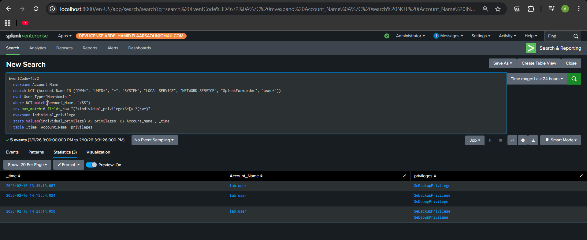
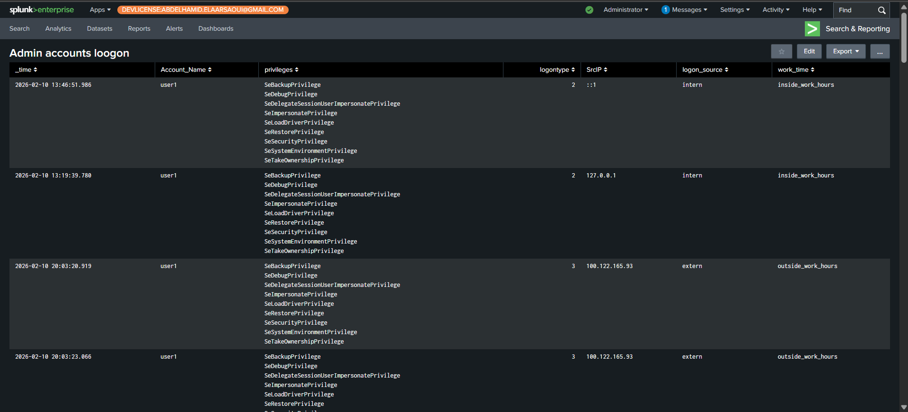

# Event ID 4672: Special Privileges Assigned to New Logon

Hello everyone,

In this report, I’m going to explore the last logon event in this repo, **Event ID 4672**: when it triggers and how it can be useful for SOC operations.
Of course, I will also try to create a dashboard combining this event with previous ones.

Anyway, let’s proceed, and everything will become clear.

---

## Event ID 4672 – Basic Information

* **Event ID:** 4672
* **Event Name:** Special Privileges Assigned to New Logon
* **Log Name:** Security
* **Provider:** Microsoft-Windows-Security-Auditing
* **Level:** Information – Audit Success

In simple words, this event is triggered when a user logs in with high privileges.
It does **not** mean that an action was taken, only that the user now has the ability to perform sensitive actions.

---

## Relationship With Other Windows Events

This event has an absolute relationship with **Event ID 4624**, because it cannot be triggered without a successful logon.

By combining it with other events such as **4625**, it becomes more useful for detecting threats and possible attacks.

---

## Common Privileges Seen in Event 4672

* **SeDebugPrivilege**
  Allows the user to debug and take control of any process on the system they are connected to locally.

* **SeTcbPrivilege**
  Allows the user to act as the operating system itself, with full control, and to bypass all security features.

* **SeBackupPrivilege**
  Gives the user the right to read all files, even if the security descriptor does not grant such access.
  It is mostly used by non-human accounts, such as backup service accounts (e.g., `svc_backup`, `veeam_svc`, `dpm_svc`).

* **SeRestorePrivilege**
  Allows the user to write files anywhere in the system.
  When combined with **SeBackupPrivilege**, it provides full control over the file system.

* **SeTakeOwnershipPrivilege**
  Allows the user to change the ownership and permissions of any file in the system.
  The user can grant themselves read/write access to any file, folder, or registry key, and also remove access from other users.

* **SeLoadDriverPrivilege**
  Allows a user to load or unload a device driver into the kernel.
  This privilege carries a high risk, as an attacker can install kernel-level rootkits, bypass security controls, and hide files, processes, or network traffic.

---

## Typical Accounts That Generate Event 4672

Under normal conditions, this event is expected for:

* Local administrator accounts
* Domain administrator accounts
* Service accounts
* System processes (`smss.exe`, `System`, `wininit.exe`, etc.)

That is why Event ID 4672 can be very noisy, but it becomes very powerful when the correct filters are applied.

---

## Why Event 4672 Is Important for SOC Operations

In simple terms, this event can help answer questions such as:

* Who logged in with administrative privileges?
* When did it happen?
* From where?
* When did a non-administrative account receive special privileges?

Whether this behavior is normal or suspicious is determined by correlating it with other events such as **4624** and **4625**.

---

## Practical Part

In this section, I will build **two dashboards**:

1. The first dashboard detects every logon of a **non-admin account** that receives special privileges and shows which privileges were assigned.
2. The second dashboard detects every logon of an **admin account** and displays detailed information such as logon type, IP address, and time.

---

## Dashboard 1: Logon of Non-Admin Accounts With Special Privileges

### SPL Query

```spl
index=* EventCode=4672
| search NOT (Account_Name IN ("DWM*", "UMFD*", "-", "SYSTEM", "LOCAL SERVICE", "NETWORK SERVICE", "SplunkForwarder", "user*"))
| rex max_match=0 field=_raw "(?<individual_privilege>Se[A-Z]\w+)"
| mvexpand individual_privilege
| stats values(individual_privilege) AS privileges BY Account_Name, _time
| table _time Account_Name privileges
```
**the dashboard:**


---

## Dashboard 2: Admin Account Logon

### SPL Query

```spl
(EventCode=4672 OR (EventCode=4624 AND Logon_Type IN (2,7,10)))
| mvexpand Account_Name
| search Account_Name=user*
| rex max_match=0 field=_raw "(?<individual_privilege>Se[A-Z]\w+)"
| mvexpand individual_privilege
| stats 
    earliest(_time) AS _time 
    values(individual_privilege) AS privileges 
    values(Logon_Type) AS logontype 
    values(Source_Network_Address) AS SrcIP 
    values(EventCode) AS events
    BY Account_Name, Logon_ID
| where mvcount(events) > 1
| eval logon_source=if(
    isnull(SrcIP) OR SrcIP="::1" 
    OR cidrmatch("172.16.0.0/12", SrcIP)
    OR cidrmatch("192.168.0.0/16", SrcIP)
    OR SrcIP="127.0.0.1",
    "intern",
    "extern"
)
| eval hour=strftime(_time,"%H")
| eval work_time=if(hour>=8 AND hour<18, "inside_work_hours", "outside_work_hours")
| table _time Account_Name privileges logontype SrcIP logon_source work_time
```
**the dashboard:**


---

**End of report.**

