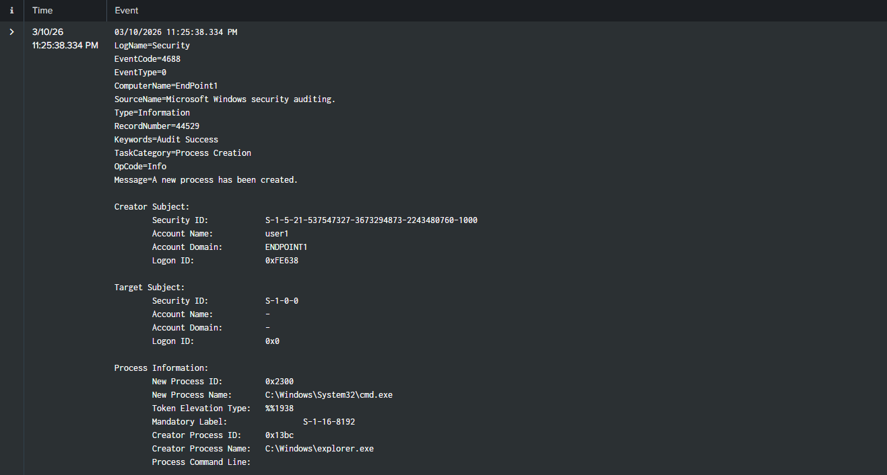
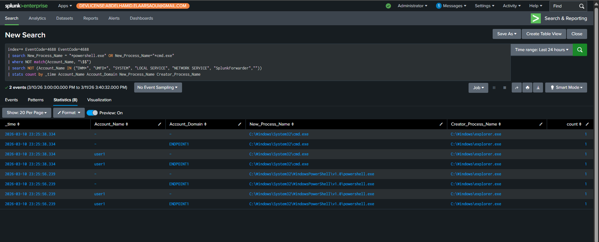
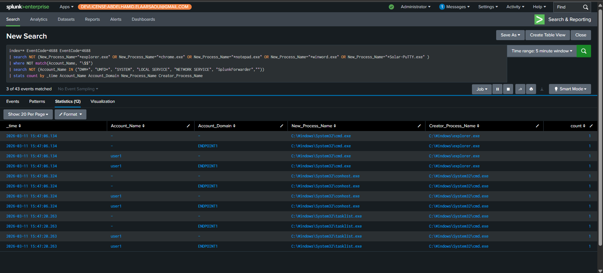

# EventID 4688 — New Process Created

Event **4688** is generated in Windows every time a new process starts (a `.exe` runs).

We can use this event to track what programs run on a system, who ran them, and how they were executed.

---

## What this event shows

### 1 — Who created the process

The account that started the process. These are the important fields:

* Security ID (SID)
* Account Name
* Account Domain
* Logon ID



---

### 2 — Target User

In some cases, the creator is not the target user. In **Event Version 2**, the **Target Subject** is shown, and it has the same fields as the creator.

---

### 3 — Process Information

**New Process ID**
A unique ID of the new process in hexadecimal.

**New Process Name**
Contains the full path of the executable.

Example:

```
C:\Program Files\SplunkUniversalForwarder\bin\splunk-regmon.exe
```

**Parent / Creator Process Name**

This also contains the path of the parent process. For attack detection, this is important because we can see the **process chain**.

---

### 4 — Command Line

Contains the full command used to start the process.

---

### 5 — Token Elevation Type

Shows the privilege level of the process.

| Value      | Meaning                                   |
| ---------- | ----------------------------------------- |
| **%%1936** | Full token (UAC disabled / administrator) |
| **%%1937** | Elevated token (Run as Administrator)     |
| **%%1938** | Limited token (normal user)               |

---

### 6 — Mandatory Integrity Level

Shows the **trust level** of the process.

| SID          | Integrity Level | Meaning                                    |
| ------------ | --------------- | ------------------------------------------ |
| S-1-16-0     | Untrusted       | Very low, untrusted                        |
| S-1-16-4096  | Low             | Sandbox processes (browser, app container) |
| S-1-16-8192  | Medium          | Standard user processes (default)          |
| S-1-16-8448  | Medium+         | Medium-high, e.g., admin with UAC          |
| S-1-16-12288 | High            | Elevated/admin processes                   |
| S-1-16-16384 | System          | OS core processes                          |
| S-1-16-20480 | Protected       | Protected processes (e.g., antivirus)      |

---

# Why Event 4688 is Important

This event is very important for **SOC operations** because it helps detect several types of attacks.

For example:

* **Living-off-the-Land attacks (LOLBins)** using built-in tools like:

  * `certutil`
  * `powershell`
  * `mshta`

* A **parent process starting a process it normally shouldn't run**, such as:

```
winword.exe → powershell.exe
```

This type of behavior can indicate **macro malware or malicious document execution**.

To summarize, **Event 4688** tells us when a program starts running and provides information about:

* Who ran it
* What program ran
* Where it ran from
* What process started it
* With what privileges

---

# Practical Part

As always, let's create a **Splunk dashboard to detect malicious activities using this event**.

---

# Scenario 1 — Command Line Execution by Normal Users

In many environments, normal users are **not expected to execute administrative shells** like `cmd.exe` or `powershell.exe`.

Monitoring these executions can help detect suspicious behavior such as:

* Manual attacker activity
* Malware execution
* Post-exploitation activity

### Detection Goals

* Monitor **Event ID 4688** process creation events
* Detect execution of **cmd.exe or powershell.exe**
* Filter out **system and service accounts**
* Focus on **interactive users**

---

### SPL Query

```spl
index=* EventCode=4688
| search New_Process_Name="*powershell.exe" OR New_Process_Name="*cmd.exe"
| where NOT match(Account_Name, "\$$")
| search NOT (Account_Name IN ("DWM*", "UMFD*", "SYSTEM", "LOCAL SERVICE", "NETWORK SERVICE", "SplunkForwarder",""))
| stats count by _time Account_Name Account_Domain New_Process_Name Creator_Process_Name
```



---

# Scenario 2 — Process Execution Outside a Whitelist

A common security practice is **application whitelisting**, where only trusted programs are allowed to run. Any process outside that list may be considered suspicious.

---

### Detection Logic

* Monitor **process creation events (4688)**
* Maintain a **whitelist of allowed applications**
* Detect processes **not included in the whitelist**

---

### Example Whitelist

* explorer.exe
* chrome.exe
* notepad.exe
* winword.exe

---

### SPL Query

```spl
index=* EventCode=4688
| search NOT (New_Process_Name="*explorer.exe" OR New_Process_Name="*chrome.exe" OR New_Process_Name="*notepad.exe" OR New_Process_Name="*winword.exe" OR New_Process_Name="*Solar-PuTTY.exe")
| where NOT match(Account_Name, "\$$")
| search NOT (Account_Name IN ("DWM*", "UMFD*", "SYSTEM", "LOCAL SERVICE", "NETWORK SERVICE", "SplunkForwarder",""))
| stats count by _time Account_Name Account_Domain New_Process_Name Creator_Process_Name
```



---

# End of the Report


